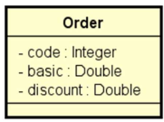
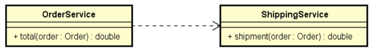

# Desafio: Sistema de Cálculo de Pedidos

Este projeto faz parte do curso **Java Spring Professional** da [DevSuperior](https://devsuperior.com.br/). O desafio consiste na criação de um sistema para calcular o valor total de um pedido, levando em consideração uma porcentagem de desconto e o valor do frete. A aplicação foi desenvolvida utilizando **Java** e **Spring Boot**, seguindo boas práticas de desenvolvimento com componentes e serviços.

## 🚀 Tecnologias Utilizadas

- Java
- Spring Boot
- Maven

## 📋 Descrição do Projeto

O objetivo é calcular o valor total de um pedido a partir de um valor básico, aplicando uma porcentagem de desconto e adicionando o valor do frete conforme as regras abaixo:

### Regras de Frete

| Valor Básico do Pedido (sem desconto)  | Valor do Frete |
| -------------------------------------- | -------------- |
| Abaixo de R$ 100,00                    | R$ 20,00       |
| De R$ 100,00 até R$ 200,00 (exclusive) | R$ 12,00       |
| R$ 200,00 ou mais                      | Grátis         |

O cálculo do valor total do pedido é feito da seguinte forma:

- Valor total = (Valor básico - Desconto) + Frete

## 🛠️ Estrutura do Projeto

A solução foi desenvolvida seguindo a arquitetura de serviços, conforme o diagrama abaixo:

### Diagrama de Classes

#### 1. Order (Pedido)

A classe `Order` representa o pedido e possui os seguintes atributos:



#### 2. OrderService e ShippingService

O serviço `OrderService` é responsável pelas operações referentes ao pedido. Ele calcula o valor total do pedido utilizando o serviço `ShippingService`.
O serviço `ShippingService` é responsável pelo cálculo do frete, aplicando as regras de valor descritas anteriormente.



## 🏗️ Estrutura do Código

O projeto segue uma estrutura organizada, com os serviços implementados como componentes Spring anotados com `@Service`.

```text
src
├── main
│   ├── java
│   │   └── com
│   │       └── devsuperior
│   │           └── desafio1
│   │               ├── entities
│   │               │   └── Order.java
│   │               ├── services
│   │               │   ├── OrderService.java
│   │               │   └── ShippingService.java
│   │               └── application
│   │                   └── Application.java
│   └── resources
│       └── application.properties
└── test
```

## ⚙️ Pré-requisitos

- Java JDK 21 ou superior
- Maven
- Spring Boot

## 🚀 Como Executar o Projeto

1. Clone o repositório:

   ```bash
   git clone https://github.com/PedroHFG/javaspring-professional-desafio1.git
   ```

2. Navegue até a pasta do projeto:

   ```bash
   cd nome-do-repositorio
   ```

3. Compile o projeto Maven:

   ```bash
   mvn clean install
   ```

4. Execute a aplicação

   ```bash
   mvn spring-boot:run
   ```

5. Verifique a saída no terminal. O resultado será exibido no log da aplicação.

## 📞 Contato

Se você tiver dúvidas ou sugestões sobre o projeto, sinta-se à vontade para entrar em contato:

- **Email**: pedrohfidg@gmail.com
- **GitHub**: [PedroHFG](https://github.com/PedroHFG)
